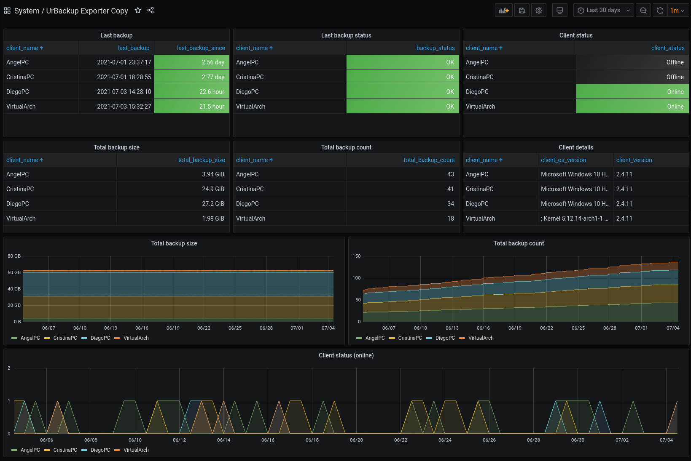

# UrBackup Exporter

[](https://github.com/ngosang/urbackup-exporter/releases)
[](https://hub.docker.com/r/ngosang/urbackup-exporter/)
[](https://www.paypal.com/paypalme/diegoheras0xff)
[](https://www.blockchain.com/btc/address/1PmeuXvamFM4hkFAJwNdSBee4pRWQW9i4d)
[](https://www.blockchain.com/eth/address/0x0D1549BbB00926BF3D92c1A8A58695e982f1BE2E)

Prometheus exporter for the [UrBackup](https://www.urbackup.org/) backup system. Tested with UrBackup server 2.4.13 and 2.5.31.

Inspired by [h3po work](https://gist.github.com/h3po/36cab38d2b443c0523c4c9e83203f382).

## Install

### Form source code

Requirements:
 * Python 3
 * [prometheus-client](https://github.com/prometheus/client_python)
 * [urbackup-server-web-api-wrapper](https://github.com/uroni/urbackup-server-python-web-api-wrapper)

```bash
pip install -r /requirements.txt

export URBACKUP_SERVER_URL=http://192.168.1.100:55414/x
python urbackup-exporter.py
```

### Docker

Docker images are available in [GHCR](https://github.com/ngosang/urbackup-exporter/pkgs/container/urbackup-exporter) and [DockerHub](https://hub.docker.com/r/ngosang/urbackup-exporter).

```bash
docker pull ghcr.io/ngosang/urbackup-exporter
or
docker pull ngosang/urbackup-exporter
```

#### Supported Architectures

The architectures supported by this image are:

| Architecture     | Default tag (Debian) | Alpine tag |
| ---------------- | -------------------- | ---------- |
| linux/386        | Yes                  | Yes        |
| linux/amd64      | Yes                  | Yes        |
| linux/arm/v6     | No                   | Yes        |
| linux/arm/v7     | Yes                  | Yes        |
| linux/arm64/v8   | Yes                  | Yes        |
| linux/ppc64le    | Yes                  | Yes        |
| linux/s390x      | Yes                  | Yes        |

#### docker-compose

Compatible with docker-compose v2 schemas:

```yaml
---
version: '2.1'
services:
  urbackup-exporter:
    image: ghcr.io/ngosang/urbackup-exporter
    container_name: urbackup-exporter
    environment:
      - TZ=Europe/Madrid
      - URBACKUP_SERVER_URL=http://<server_host>:55414/x
      - URBACKUP_SERVER_USERNAME=admin
      - URBACKUP_SERVER_PASSWORD=1234
      - EXPORT_CLIENT_BACKUPS=true
    ports:
      - 9554:9554
    restart: unless-stopped
```

#### docker cli

```bash
docker run -d \
  --name=urbackup-exporter \
  -e TZ=Europe/Madrid \
  -e URBACKUP_SERVER_URL=http://<server_host>:55414/x \
  -e URBACKUP_SERVER_USERNAME=admin \
  -e URBACKUP_SERVER_PASSWORD=1234 \
  -e EXPORT_CLIENT_BACKUPS=true \
  -p 9554:9554 \
  --restart unless-stopped \
  ghcr.io/ngosang/urbackup-exporter
```

## Configuration

All configuration is done with environment variables.

- `URBACKUP_SERVER_URL`: UrBackup server URL including host, port and API endpoint. Example: `http://192.168.1.100:55414/x`
- `URBACKUP_SERVER_USERNAME`: (Optional) Username to login in the server. Only required if authorization is enabled. The default is `admin`.
- `URBACKUP_SERVER_PASSWORD`: (Optional) Password to login in the server. Only required if authorization is enabled. The default is `1234`.
- `EXPORT_CLIENT_BACKUPS`: (Optional) Export detailed metrics for each client. This option can generate a lot of metrics if there many configured clients. The default is `true`.
- `LISTEN_PORT`: (Optional) The address the exporter should listen on. The default is `9554`.
- `LISTEN_ADDRESS`: (Optional) The address the exporter should listen on. The default is
   to listen on all addresses.
- `LOG_LEVEL`: (Optional) Log level of the traces. The default is `INFO`.

## Exported metrics

| Name                          | Type    | Description                  |
| ----------------------------- | ------- | ---------------------------- |
| urbackup_client_online        | gauge   | Whether or not the client is answering the server |
| urbackup_client_status        | gauge   | Status number, purpose unknown |
| urbackup_client_lastseen      | gauge   | Timestamp the client was last seen online |
| urbackup_backup_ok            | gauge   | Whether or not the last backup was successful |
| urbackup_backup_issues        | gauge   | Number of issues during the last backup |
| urbackup_backup_lasttime      | gauge   | Timestamp of the last backup |
| urbackup_backup_number_total  | counter | Number of backups |
| urbackup_backup_size_total    | counter | Total size of backups in bytes |

## Prometheus config

Example Prometheus configuration:

```yaml
scrape_configs:
  - job_name: 'urbackup-exporter'
    static_configs:
      - targets: ['192.168.1.100:9554']
```

## Prometheus / Alertmanager rules

Example Prometheus rules for alerting:

```yaml
  - alert: UrBackupOutdated
    # 1209600 = 15 days
    expr: time() - urbackup_backup_lasttime{backup_type="file"} > 1209600
    for: 0m
    labels:
      severity: critical
    annotations:
      summary: UrBackup {{ $labels.client_name }} backup is outdated
      description: UrBackup backup is outdated\n  VALUE = {{ $value }}\n  LABELS = {{ $labels }}

  - alert: UrBackupFailure
    expr: urbackup_backup_ok{backup_type="file"} == 0
    for: 0m
    labels:
      severity: critical
    annotations:
      summary: UrBackup {{ $labels.client_name }} backup failed
      description: UrBackup backup failed\n  VALUE = {{ $value }}\n  LABELS = {{ $labels }}
```

## Grafana dashboard

There is a reference Grafana dashboard in [grafana/grafana_dashboard.json](./grafana/grafana_dashboard.json).


